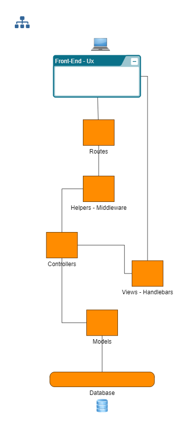
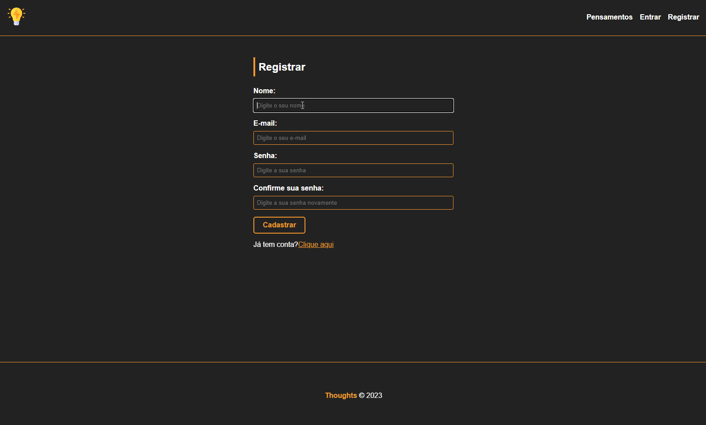
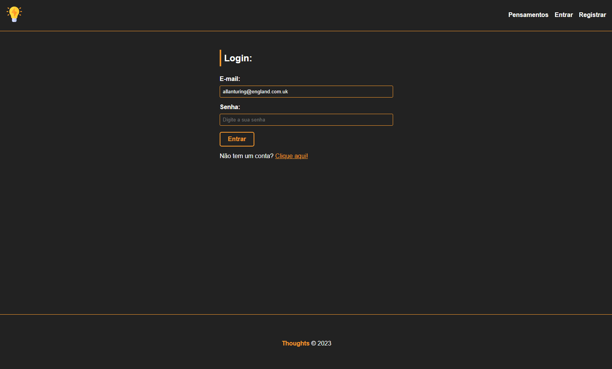
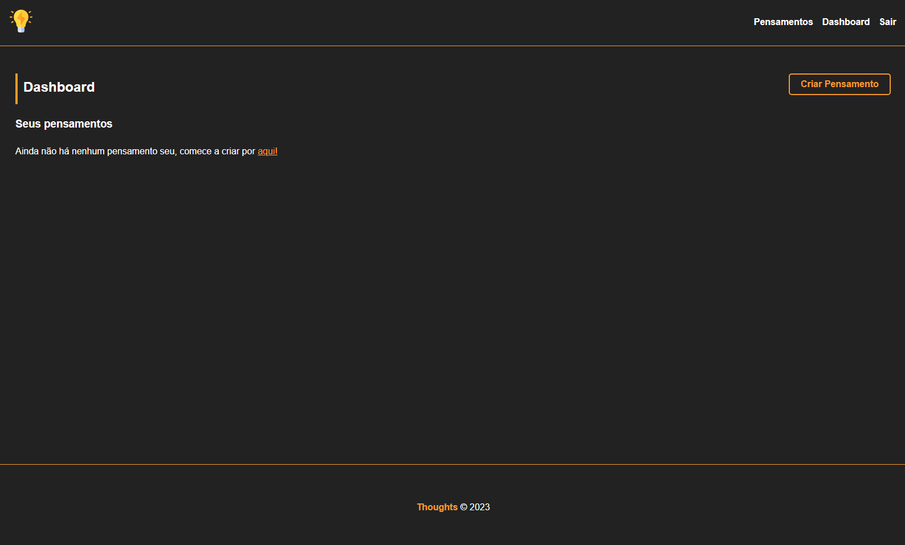
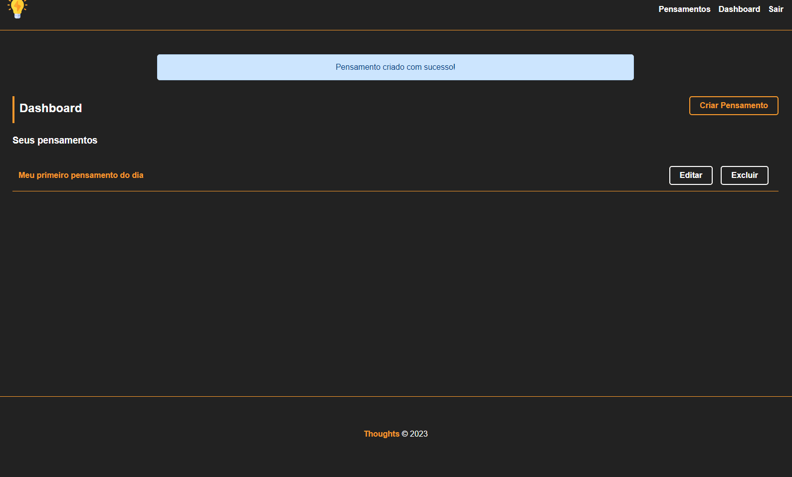
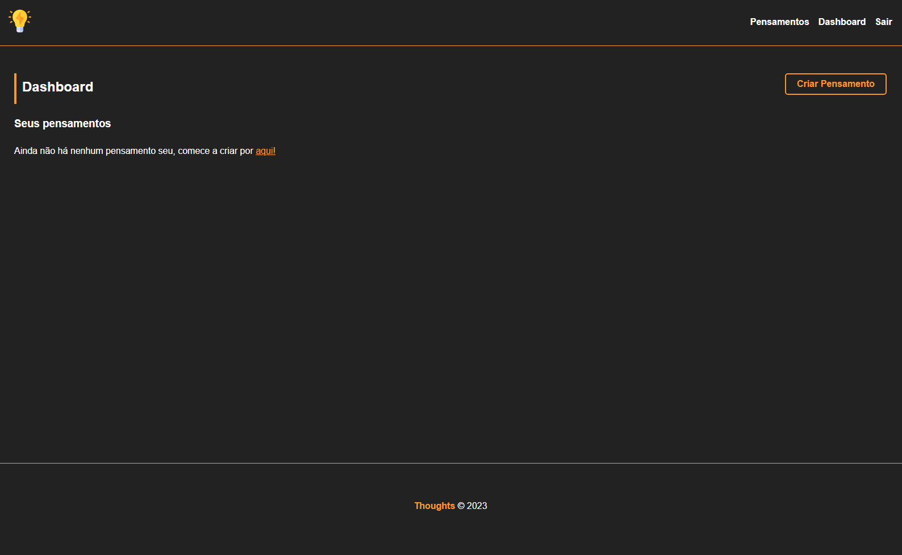

# Thoughts_MVC 💭
🏳️ Projeto com intuito de cadastrar diversos tipos de pensamentos, onde o usuário pode abrir uma conta, fazer login e cadastrar seu pensamento. 🏁

🏴‍☠️ Utilizando Arquitetura MVC(Model, View, Controller), ORM Sequelize para conectar ao banco de Dados, Segurança e Validação de Dados e Mensageria de Cookies Session para identificar quando usuário está logado 🏴‍☠️
#

### skills:

* CSS
    * Flex-Box

* Javascript
    * Classes
    * Funções
    * Arquitetura MVC
        * Models
        * Views
            * Handlebars
        * Controllers
        * Helpers
            * Middleware
        * Routes

* Node.js
    * "bcryptjs": "^2.4.3"
    * "connect-flash": "^0.1.1",
    * "cookie-parser": "^1.4.6",
    * "cookie-session": "^2.0.0",
    * "express": "^4.18.2",
    * "express-flash": "^0.0.2",
    * "express-handlebars": "^7.0.7",
    * "express-session": "^1.17.3",
    * "mysql2": "^3.2.3",
    * "nodemon": "^2.0.22",
    * "sequelize": "^6.31.0",
    * "session-file-store": "^1.5.0"

* MySQL WorkBench
    * ORM Connect Database

#

### Initial Project

    npm start

#

    <h3>Project Scopes</h3>
    

#

    <h3>Criar Conta</h3>
    

#

    <h3>Login e Validação</h3>
    

#

    <h3>Criar Pensamentos</h3>
    

#

    <h3>Editar, Excluir e visualizar Dashboard</h3>
    

#

    <h3>Filtros de Pensamentos</h3>
    

